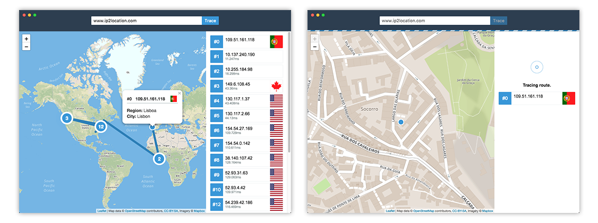
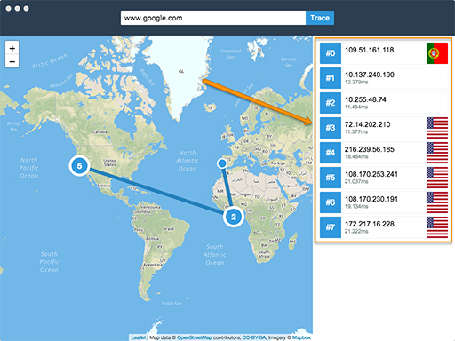
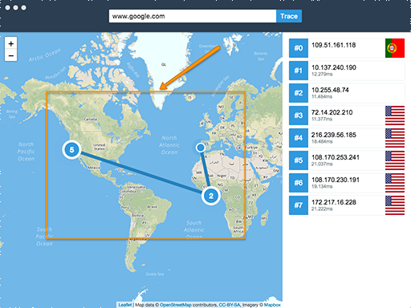
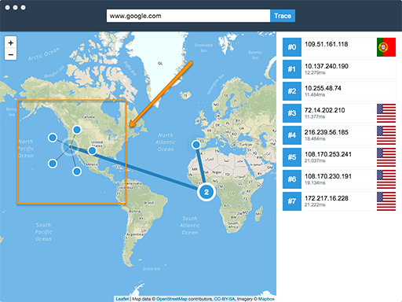
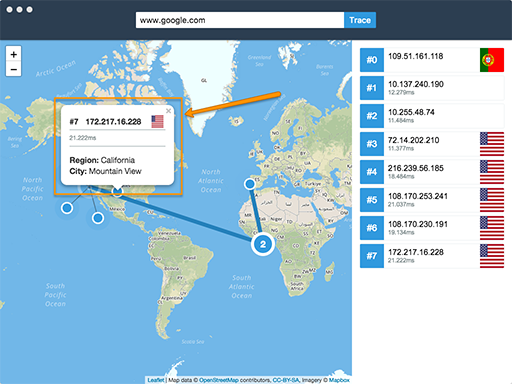

# Visual Traceroute
Visual Traceroute is a tool to visualize the result of a traceroute in a map.



# How it Works
By a given host/domain the gathered information from the traceroute (addresses), is used to find each hop location with ip2location, and afterward, the route is applied to a map with a path and markers with the hop information.

# How to Use it?
You can use it locally (tracing the route from your own network) or through www.visualtraceroute.network (under development).

## Locally

1. Clone the project
```
$ git clone https://github.com/andrejesuscm/visualtraceroute.git 
```

2. Install dependencies
```
$ npm install
```

3. run it!
```
$ npm run visualtraceroute
```

## Features

### Hops List


On the results panel, you can see the hops list were you the hop number, host, country and response times can be seen.

### Map markers


You can have a visually understand the location of each host. When there is too many markers close together, they will get clustered and a bigger marker will appear with the number of clustered items inside. when clicking in the cluster, the map will zoom in in order to expand them.



Whenever there are multiple hops in the same location we will have them also clustered in a bigger maker and when clicked we can visualize them in a spider web way.



When clicked in the hop markers, we can view more detailed information on a popup.


## From www.visualtraceroute.network
(under development)

